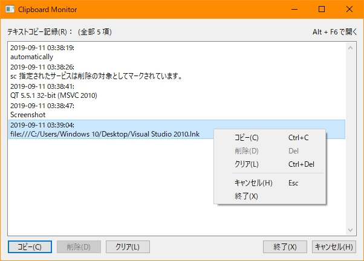

# ClipboardMonitor
+ System clipboard changing monitor.

### Environment
+ `MSVC 2010`
+ `QT 5.5.1 32-bit (MSVC 2010)`
+ `Windows 10 Version 1803`

### Tips
+ Application will hide window automatically, Press `Alt+F6` to show main window.

### Screenshot
